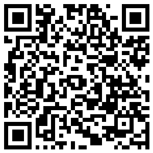

# ワイン・テイスティングノート 🍷

ワインを飲んだときの印象を、かんたんに記録できるアプリです。
J.S.A.（日本ソムリエ協会）のテイスティング用語選択用紙をもとに作られていて、香りや味わいの表現に迷ったときも、用意された言葉をタップして選ぶだけで記録できます。

インストールは不要です。教えてもらったURLを開けば、それだけで使い始められます。

## 使いはじめる

1. 教えてもらったURLをブラウザ（Safari、Chromeなど）で開く。
2. 「記録する」タブが最初に表示されます。ここから記録をスタート。
3. よく使うなら、ホーム画面に追加したりブックマークしておくと、次からすぐに開けて便利です。

## ワインを記録する

1. 「記録する」タブで、白ワイン／赤ワインを選びます。
2. タイトル（ワイン名など、自由に）を入力します。
3. 「外観」「香り」「味わい」「評価」「ブドウ」の項目が並んでいるので、当てはまる言葉のチップをタップして選びます（1つの項目で複数選んでもOK）。
4. 最後にコメント欄に自由に感想を書きます。
5. 「この内容を記録する」ボタンを押せば保存完了です。

## 記録をあとで見る・直す

「記録一覧」タブに切り替えると、これまで記録したワインが新しい順に並びます。

- 記録をタップすると開いて、内容を見られます。
- 開いた状態でそのまま内容を書き換えて、「更新」を押せば修正できます。
- 🗑（ゴミ箱）ボタンで削除できます。
- もう一度タップすれば閉じます。

## 採点機能（ブラインドテイスティングの練習に）

答え合わせをしたいとき用の機能です。

- 「外観」「香り」「味わい」「評価」の各グループの右下に「正解数」という入力欄があります。用語選択でいくつ正解したかをここに入力すると、自動で点数が計算されます。
- 「収穫年」「生産地（国）」「主なブドウ品種」には、それぞれ下に「正解／不正解」を選ぶボタンがあります（生産地を外すと収穫年の点数も0点になります）。
- 入力した内容は、記録の下の方にある「採点結果」というカードにまとまって表示され、一番下に合計点も出ます。

## データはどこに保存される？

記録したデータは、今使っている端末・ブラウザの中だけに保存されます。どこかのサーバーに送信されることはありません。

そのぶん、次のことに気をつけてください。

- **別の端末やブラウザでは記録は共有されません。** 同じiPhoneでもSafariで記録したものはChromeには出てきません。
- **ブラウザの履歴やデータを消すと、記録も一緒に消えてしまいます。** 大事な記録は、下記の「バックアップ」で書き出しておくと安心です。

## バックアップ・引っ越し

一覧画面の右上に「📤 エクスポート」「📥 インポート」というボタンがあります。

- **📤 エクスポート**：これまでの記録をぜんぶ1つのファイルに書き出せます。バックアップとして端末に保存しておきましょう。ファイル名は初期値として「wine_tasting_notes_書き出した日付.csv」（例：`wine_tasting_notes_2026-08-12.csv`）が入りますが、保存時に好きな名前に変更できます。
- **📥 インポート**：書き出しておいたファイルを読み込んで、記録を復元・追加できます。機種変更のときなどに使ってください。

  
   
  <a href="https://gkspkng.github.io/wine_tasting_note/wine_tasting_note.html">https://gkspkng.github.io/wine_tasting_note/wine_tasting_note.html</a>

